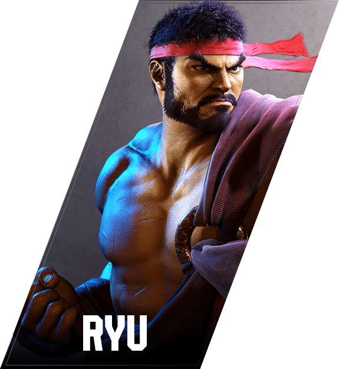
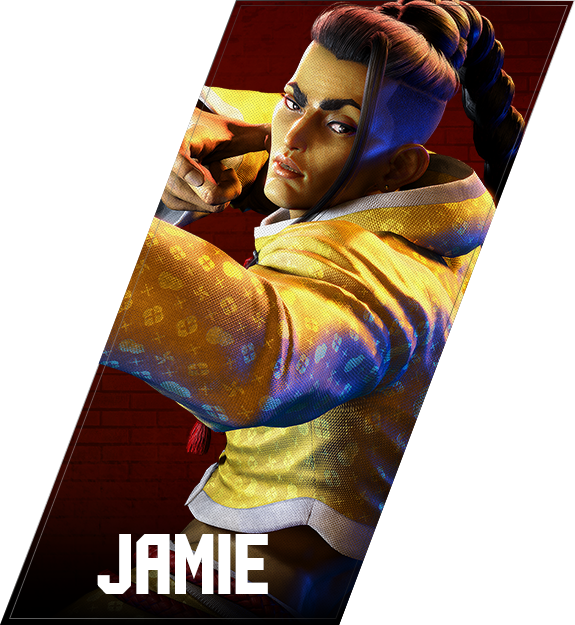
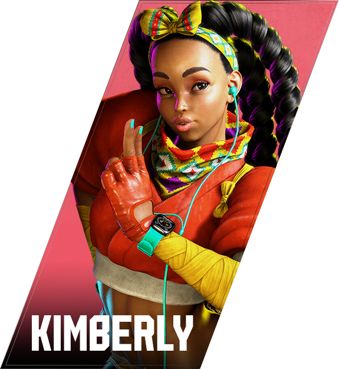


Not sure who to play in Street Fighter 6? Take this character quiz to find out!


## Street Fighter 6 Character Quiz!

<form>

### How experienced are you with fighting games? Choose the option that best suits you.

  <label>
    <input type="radio" name="q1" value="b">
    I am a beginner / or am new to the fighting game genre.
  </label> 
  <label>
    <input type="radio" name="q1" value="a">
    I have played fighting games before and I enjoy them on a casual level.
  </label> 
  <label>
    <input type="radio" name="q1" value="s">
    I am passionate about fighting games and play / want to play at a competitive level.
  </label> 

### Which of the following best matches your preferred playstyle? (You can use your experiences from other games).

  <label>
    <input type="radio" name="q2" value="b">
    Balanced. An all-rounder playstyle. Jack of all trades, master of none.
  </label> 
  <label>
    <input type="radio" name="q2" value="p">
    Power. I don't mind being slow! I like being tanky & strong!
  </label> 
  <label>
    <input type="radio" name="q2" value="s">
    Speed. I like to overwhelm my opponent with fast attacks!
  </label> 
  <label>
    <input type="radio" name="q2" value="r">
    Ranged. I like to fight from a distance without my opponent getting close.
  </label> 

### Which character do you want to play? (This can be for any reason).

  <label for="ryu">
  
  <input type="radio" id="ryu" name="q3" value="ry">
  </label>

  <label for="ken">
  
  <input type="radio" id="ken" name="q3" value="ke">
  </label>

  <label for="chun">
  
  <input type="radio" id="chun" name="q3" value="ch">
  </label>

  <label for="juri">
  
  <input type="radio" id="juri" name="q3" value="ju">
  </label>

  <label for="luke">
  
  <input type="radio" id="luke" name="q3" value="lu">
  </label>

  <label for="jamie">
  
  <input type="radio" id="jamie" name="q3" value="ja">
  </label>

  <label for="kimberly">
  
  <input type="radio" id="kimberly" name="q3" value="ki">
  </label>

  <label for="cammy">
  
  <input type="radio" id="cammy" name="q3" value="ca">
  </label>

### Do you have fun with technical game mechanics? Or do you prefer to keep things simple?

  <label>
    <input type="radio" name="q4" value="s">
    Keep things simple. I want to just focus on playing at my best!
  </label> 
  <label>
    <input type="radio" name="q4" value="t">
    Technical! I love to practice things that are hard to master!
  </label> 
  <label>
    <input type="radio" name="q4" value="n">
    I don't mind.
  </label> 

### Do you prefer to play the hero or villain?

  <label>
    <input type="radio" name="q5" value="h">
    I like heroic characters.
  </label> 
  <label>
    <input type="radio" name="q5" value="v">
    I like to play as the villain!
  </label> 
  <label>
    <input type="radio" name="q5" value="n">
    I don't mind.
  </label> 
    
### Do you have a character gender preference?

  <label>
    <input type="radio" name="q6" value="n">
    No preference, please don't factor gender into my result.
  </label> 
  <label>
    <input type="radio" name="q6" value="m">
    I prefer to play male characters.
  </label> 
  <label>
    <input type="radio" name="q6" value="f">
    I prefer to play female characters.
  </label> 

 

  <button type="submit">Submit</button>


</form>

